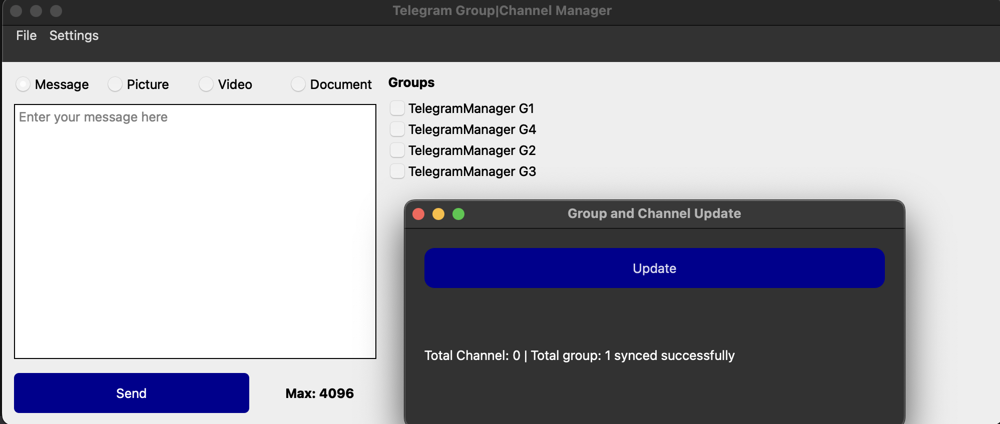

# Telegram Group and Channel Manager
This repository is served to manage Telegram groups and channels by connecting with the Telegram bot.

## Package Installation
```
pip install -r requirements
```

## Run the application
```
python MainApplication.py
```

## Packaging the application
```
pyinstaller -n <app_name> [options] -w MainApplication.py

#Update <app_name>.spec to include required folders
datas=[('contents', 'contents'), ('icons', 'icons')] # These two folders are currently important to be existed in the application packaging
```

## Usage


1. Create a Telegram bot
2. Open this application >> Settings >> Bot and fill in bot information
3. Add your bot to any groups or channels
4. Go to Settings >> Group & Channels to update resources

After the above steps are done, you can now start broadcasting the message text, videos, pictures, or documents
